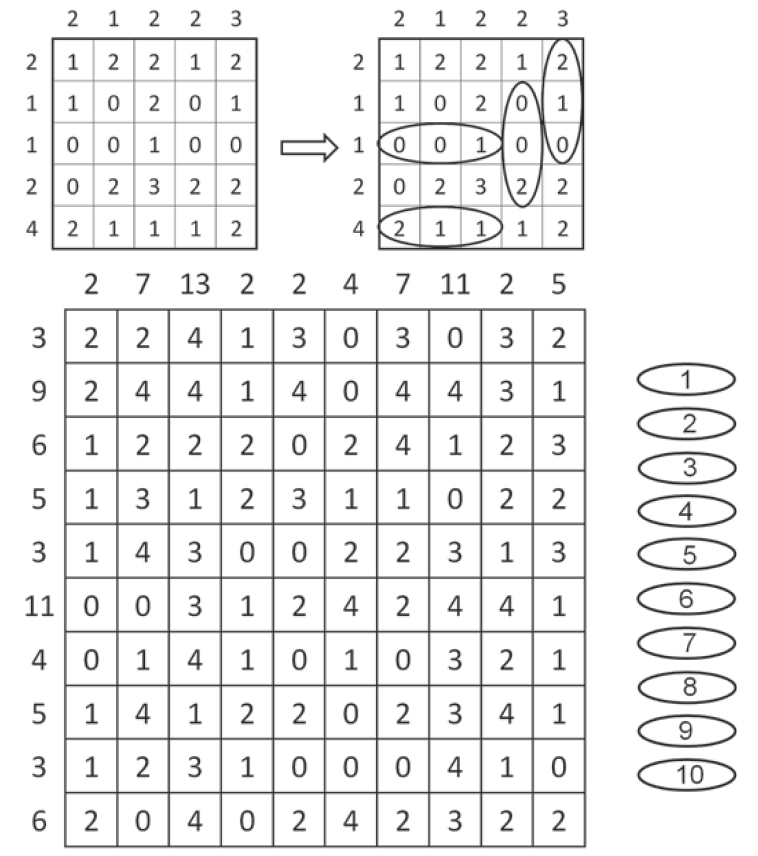

# EDD2018-1

##Description
Dans le diagramme ci-dessus, il faut dessiner 10 pilules, avec les valeurs de 1 à 10 (chaque valeur figurant exactement une fois).
Les pilules recouvrent des rectangles d'une longueur de exactemaent 3 cases, leurs positions sont horizontales ou verticales.
Les pilules ne se chevauchent pas.
La valeur d'un pilule est la somme des nombres dans les 3 cases dedans.
Les nombre au bord du chéma indiquent la somme de nombre dans les cases qui font partie d'une pilule dans la ligne / la colonne correspondante.

##Sample

